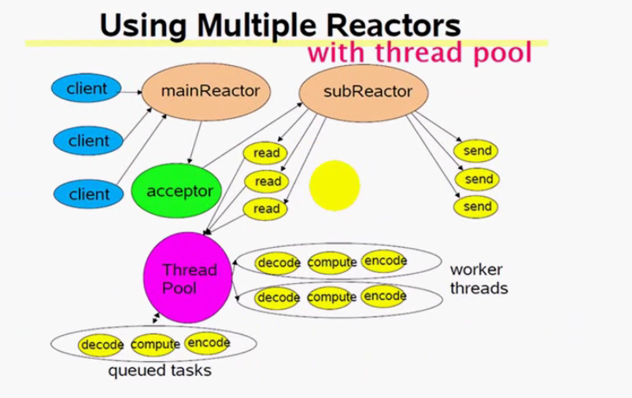

# IncompleteWebServer      
这个项目是看完muduo后模仿muduo而写的一个httpServer，实现的功能也很简单目前仅仅支持http的get请求。

这个项目虽然简单，但是Web服务器很好的贯穿了之前所学的知识，比如网络编程与Linux系统编程。
通过这个也进一步学习了
* TCP/IP 协议
* 解析HTTP协议
* 多线程编程
* 锁的使用
* Linux下开发工具使用
* 初步学习了cmake的使用

该项目大量借鉴了muduo的编程思想。


*******************


### 环境
* OS：Ubuntu
* complier：g++

### 构建
```bash
./build.sh
```

### 使用
```bash
./MyServer
```
你需要在这个的程序的working directory 提供index.html，来访问。


### 使用的技术
* 使用Epoll LT的IO多路复用技术，非阻塞IO，使用基于Reactor的事件模型。
* 使用池化技术，创建了IO线程池+计算线程池，避免了频繁的创建线程。
* 定时器基于堆的实现来关闭超时的请求。
* 主线程负责Acceptor来接受连接请求，IO线程池来处理连接的IO请求。
* 对fd进行抽象提供一个Channel来管理所有的fd与他们所关心的IO事件。
* 使用eventfd而不是信号来唤醒IO线程，统一IO事件源。
* 使用双缓冲区技术实现了简单的异步日志系统。


### 并发模型
使用multiple Reactors + threadpool的模型，这也是muduo所提倡的模型。           
multiple Reactor模型主要来处理我们的IO事件（我们也可以指定IO线程做一些计算任务）      
使用这种模型来处理突发性IO+计算密集型任务。




